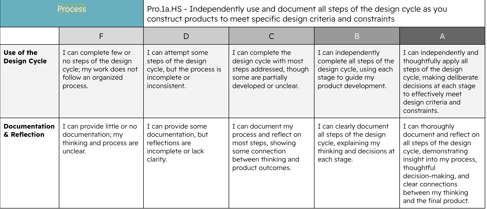
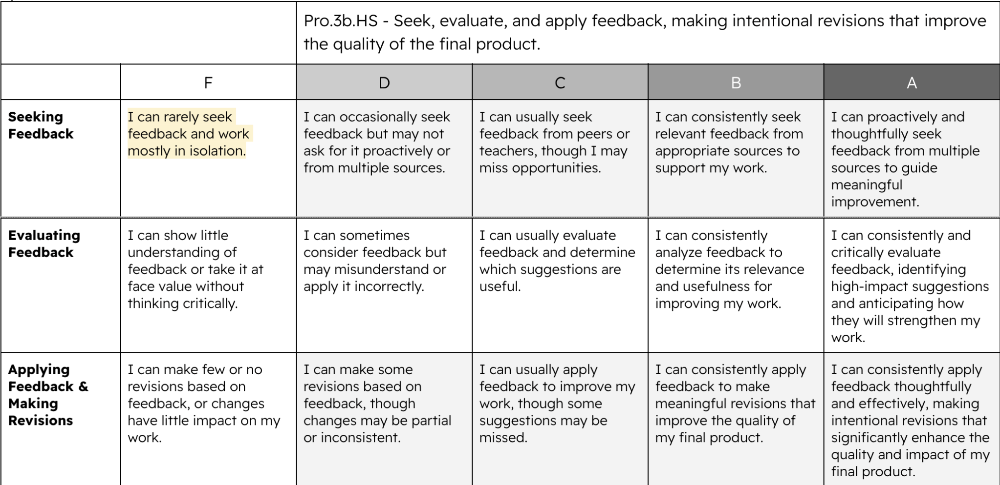
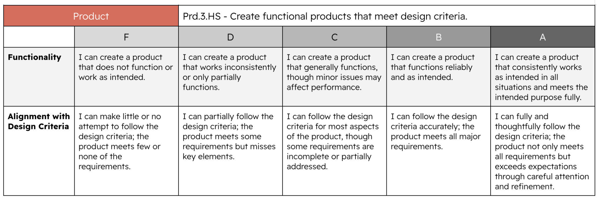

# Practice Portfolio - AP CS A

We will use this folder assignment to keep track of in-class examples and practice assignments. You will be expected to do a variety of assignments in this folder, submitting as you go, with documentation and comments along the way.

## Folder Structure

The workspace contains three folders, where:

- `src`: the folder where we will put our java files. You will create a minimum of one `.java` file per assignment, sometimes more than one. Make sure not to duplicate names!
- `data`: data files will be placed here, as needed. They should be named to match the main `.java` file of the class, for easy organization.
- `docs`: for many assignments, you will be expected to write a documentation of the problem - what you did, problems you faced, what you learned

## How this is assessed

### Process

What you write in comments and your docs, along with my observations of your problem-solving process, will be used to help assess your **Process grade** for the semester.
  
#### Process Standard 1 - Using and documenting the Design Cycle

For this course, our Design Cycle is the problem-solving process: defining the problem you are trying to solve, preparing to solve it through looking up similar problems or using references, attempting to solve it, then reflecting by debugging and correcting until it works. For a high grade in this standard, all steps of this process must be made visible and clearly documented in code and your documentations.

#### Process Standard 3 - Use of Feedback** 

There should be times you get feedback and advice from me and from your peers in the class, and it will result in you improving your work on these problems / mini-projects. Ideally, some or all of those moments will be documented or cited in your documentation! Though a smaller portion of your Process grade than the previous standard, it will nonetheless be evaluated.

### Product

The functionality of your assignments - how accurately they reflect the problem requirements and the polish of their presentation - will be used to help assess your Product grade for the semester

### Expertise

The correctness, clarity, and quality of your code will contribute to your Expertise grade for the semester, though this will be primarily evaluated through tests and quizzes.

